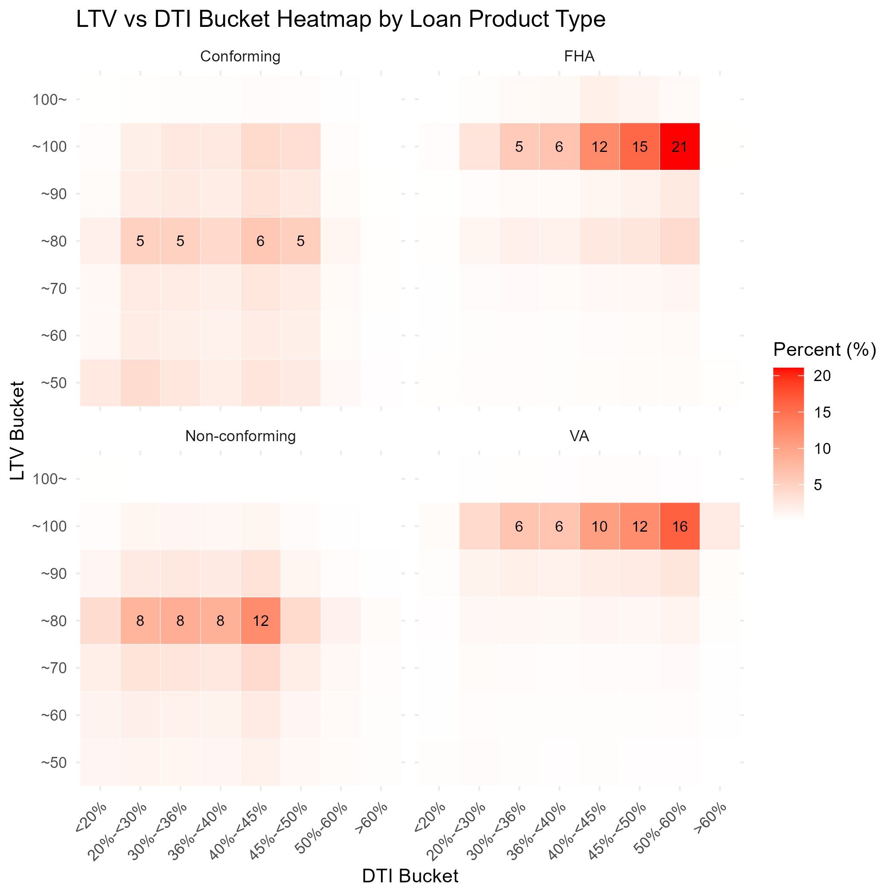
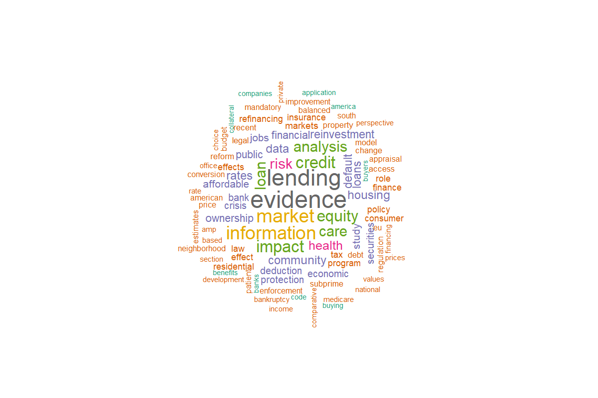

```{r setup, include=FALSE}
knitr::opts_chunk$set(echo = TRUE, message = FALSE, warning = FALSE)
library(data.table); library(dplyr); library(ggplot2)
library(scales); library(janitor); library(ggpubr); library(flextable)
library(tidyr); library(readxl); library(plotly); library(lubridate)
library(purrr); library(zoo); library(gridExtra); library(DT)
```

---

## 📁 0. 데이터 로드 및 환경 설정

```{r}
hmda_file <- "https://ffiec.cfpb.gov/data-browser/data/2023?category=lar-csv"
download.file(hmda_file, destfile = "2023_hmda_lar.csv", mode = "wb")
data_hmda <- fread("2023_hmda_lar.csv")
```

---

## 1.  Action Taken codes

```{r}

### a. description table
action_taken_desc <- data.table(
  action_taken = 1:8,
  description = c(
    "Loan originated (대출 실행됨)",
    "Approved but not accepted (승인됐으나 수락 안됨)",
    "Application denied (거절됨)",
    "Withdrawn by applicant (신청인이 철회함)",
    "File closed for incompleteness (서류 미비로 폐기됨)",
    "Purchased loan (인수한 대출)",
    "Preapproval denied (사전승인 요청 거절됨)",
    "Preapproval approved not accepted (실행 안됨)"
  )
)

### b. count by codes 
deny_yn <- data_hmda[, .(
  cnt = .N,
  amt = trunc(sum(loan_amount) / bn)
), by = 'action_taken'] %>%
  merge(action_taken_desc, by = "action_taken", all.x = TRUE) %>%
  mutate(
    pct_amt = round(amt / sum(amt) * 100, 1)  # 계산 먼저
  ) %>% 
  adorn_totals('row', name='Total') %>% 
  mutate(
    cnt = comma(cnt),     # 이후 포맷팅
    amt = comma(amt)
  ) %>%
  select(
    code = action_taken,
    description,
    cnt,
    amt,
    pct_amt
  ) %>%
  arrange(code) 


output_deny_yn <- deny_yn
knitr::kable(output_deny_yn)
```

---

## 2. approval rate by race (rece is typo)

```{r}
by_rece_info <- data_hmda[grepl('1|2|3',action_taken), .(
  cnt = .N,
  amt = trunc(sum(loan_amount) / bn),
  mean_loan_amount=mean(loan_amount,na.rm=T),
  mean_grossAnnualIncome_inK=mean(income,na.rm=T)
), by = list(derived_race)
]

by_rece_approved <- data_hmda[action_taken=='1', .(
  app_cnt = .N,
  app_amt = trunc(sum(loan_amount) / bn),
  app_mean_loan_amount=mean(loan_amount,na.rm=T),
  app_mean_grossAnnualIncome_inK=mean(income,na.rm=T)
), by = list(derived_race)
]

by_rece_info_approved <- merge(by_rece_info,by_rece_approved, by='derived_race') %>% 
  mutate(app_pct_cnt=round(app_cnt/cnt*100,1),
         app_pct_amt=round(app_amt/amt*100,1),
         ) %>% 
  arrange(desc(cnt)) %>% 
  adorn_totals('row',name='Total')

output_by_rece_info_approved <- by_rece_info_approved

knitr::kable(output_by_rece_info_approved)
```

---

## 3. deny rate heat map by race and income quintile

```{r, fig.width=8, fig.height=5}
 2023년 분위 경계 (단위: 천 달러로 가정 — HMDA income 변수 기준)
##
bucket_breaks <- c(-Inf, 18.98, 33.00, 47.91, 62.20, 80.61, 101.00, 127.30, 165.30, 234.90, Inf)
bucket_labels <- c(
  "P1 (bottom 10%)",
  "P2",
  "P3",
  "P4",
  "P5",
  "P6",
  "P7",
  "P8",
  "P9",
  "P10 (Top 10%)"
)

# binning by income quintile
data_hmda[, income_bucket := cut(
  income,                      # income은 1,000달러 단위여야 함
  breaks = bucket_breaks,
  labels = bucket_labels,
  include.lowest = TRUE,
  right = FALSE
)]

####a. action_taken 1~3만 필터링 및 승인 여부 파생 변수 생성
dt_sub <- data_hmda[action_taken %in% 1:3]
dt_sub[, approval := fifelse(action_taken == 1, "approved", "denied")]

###b. derived_race 및 income_bucket별 denial rate 계산
denial_summary <- dt_sub[, .(
  n_total = .N,
  n_denied = sum(approval == "denied")
), by = .(derived_race, income_bucket)
][, denial_rate := round(n_denied / n_total * 100, 1)]

###c. 대상 인종만 필터링
target_races <- c("White", "Black or African American", "Asian", "Joint", "Race Not Available")
denial_summary <- denial_summary[derived_race %in% target_races]

###d. income_bucket 정렬 순서 명시 (factor 레벨 고정)
bucket_levels <- c(
  "P1 (bottom 10%)", "P2", "P3", "P4", "P5",
  "P6", "P7", "P8", "P9", "P10 (Top 10%)"
)
denial_summary[, income_bucket := factor(income_bucket, levels = bucket_levels)]

denial_summary <- 
denial_summary %>% 
  mutate(derived_race=
           case_when(grepl('Available',derived_race)~"NA",
                     grepl('Black',derived_race)~"Black",
                     TRUE~derived_race))


###e. ggplot2로 히트맵 시각화
output_gr_denial_rate_income_bucket <- 
  ggplot(denial_summary , aes(x = income_bucket, y = derived_race, fill = denial_rate)) +
  geom_tile(color = "white") +
  geom_text(data = denial_summary[!is.na(denial_rate)],
            aes(label = paste0(denial_rate, "%")),
            size = 3) +
  scale_fill_gradient(low = "white", high = "red", name = "Denial Rate (%)", na.value = "grey90") +
  labs(
    title = "",
    x = "",
    y = ""
  ) +
  theme_minimal(base_size = 12) +
  theme(
    axis.text.x = element_text(angle = 45, hjust = 1),
    panel.grid = element_blank(),
    legend.position = "none" 
  )
getwd()
ggsave( 'output_gr_denial_rate_income_bucket.png',
        output_gr_denial_rate_income_bucket)

```

---

## 4. 상품 유형 분석

### 4.1 상품별 승인 대출 건수 및 비중

```{r}
##4.1 originated, loan purpose ------------
##Convert loans under conforming loan limit and not FHA, VA loans to Conforming
##loans conventional but not under the limit become non-conforming

data_hmda <- 
data_hmda[, derived_loan_product_type := case_when(
  conforming_loan_limit == "C" & str_detect(derived_loan_product_type, "Conventional") ~ 
    str_replace(derived_loan_product_type, "Conventional", "Conforming"),
  str_detect(derived_loan_product_type, "Conventional") ~ 
    str_replace(derived_loan_product_type, "Conventional", "Non-conforming"),
  TRUE ~ derived_loan_product_type
)]

by_product_type  <- data_hmda[action_taken=='1', .(
  cnt = .N,
  amt = trunc(sum(loan_amount) / bn)
), by = 'derived_loan_product_type'] 

by_loan_purpose <- data_hmda[action_taken=='1', .(
  cnt = .N,
  amt = trunc(sum(loan_amount) / bn)
), by = list(derived_loan_product_type,loan_purpose=
               case_when(grepl('1',loan_purpose)~"Purchase",
                         grepl('3',loan_purpose)~"Refinance",
                         TRUE~"Other")
                  )
]

by_loan_purpose_summary <- by_loan_purpose %>% 
  group_by(derived_loan_product_type) %>% 
  mutate(pct=round(cnt/sum(cnt)*100,1)) %>% 
  dcast(derived_loan_product_type~loan_purpose, value.var='pct')

output_by_product_type <- by_product_type %>% 
  left_join(by_loan_purpose_summary) %>% 
  select(derived_loan_product_type,cnt,amt) %>% 
  mutate(pct_tot_cnt=round(cnt/sum(cnt)*100,1),
         pct_tot_amt=round(amt/sum(amt)*100,1)) %>% 
  mutate(cntpct=paste0(format(cnt,big.mark=','),"(",pct_tot_cnt,")"),
         amtpct=paste0(format(amt,big.mark=','),"(",pct_tot_amt,")")) %>% 
  arrange(derived_loan_product_type) 


```

### 4.2 대출 조건 통계

```{r}

# a. 필터링
data_hmda_primary <- data_hmda[action_taken == '1']

# b. 파생변수 생성 (by reference)
data_hmda_primary[, product_type_large := str_remove_all(derived_loan_product_type, ':.*$')]


data_hmda_primary[, loan_amount := as.numeric(loan_amount)]
data_hmda_primary[, interest_rate := as.numeric(interest_rate)]
data_hmda_primary[, origination_charges := as.numeric(origination_charges)]


# 레벨 순서 수동 정의
dti_levels <- c(
  "<20%", "20%-<30%", "30%-<36%",
  "36", "37", "38", "39", "40", "41", "42", "43", "44", "45", "46", "47", "48", "49",
  "50%-60%", ">60%", 
  "Exempt"
)

age_levels <- c("<25", "25-34", "35-44", "45-54", "55-64", "65-74", ">74", "8888")


# 순서대로 factor로 변환
data_hmda_primary[, debt_to_income_ratio := factor(debt_to_income_ratio, levels = dti_levels)]

data_hmda_primary[, applicant_age  := factor(applicant_age , levels = age_levels)]


# 통계 요약 계산
###a. 분석 대상 변수 목록
measure_vars <- c("loan_amount", "interest_rate", "origination_charges")

###b. 긴 형식으로 melt
long_dt <- melt(
  data_hmda_primary,
  id.vars = "product_type_large",
  measure.vars = measure_vars,
  variable.name = "variable",
  value.name = "value"
)

###c. 그룹별 상위 1% 컷오프값 계산
q99 <- long_dt[, .(cutoff = quantile(value, 0.99, na.rm = TRUE)), by = .(product_type_large, variable)]

###d. cutoff 기준으로 필터링된 데이터 결합
long_dt_trim <- merge(long_dt, q99, by = c("product_type_large", "variable"))
long_dt_trim <- long_dt_trim[value <= cutoff]


###e. 통계 요약 + 포맷 적용 (결과는 모두 character로 강제 통일)
summary_stats_loanprofile <- long_dt[, {
  x <- if (variable %in% c("loan_amount", "origination_charges")) trunc(value) else value
  
  mean_val   <- if (variable %in% c("loan_amount", "origination_charges")) 
    comma(trunc(weighted.mean(x,by=loan_amount, na.rm = TRUE))) else 
        format(round(weighted.mean(x,x,by=loan_amount, na.rm = TRUE), 3), nsmall = 3)
  p5_val     <- if (variable %in% c("loan_amount", "origination_charges")) comma(trunc(quantile(x, 0.05, na.rm = TRUE))) else format(round(quantile(x, 0.05, na.rm = TRUE), 3), nsmall = 3)
  p25_val    <- if (variable %in% c("loan_amount", "origination_charges")) comma(trunc(quantile(x, 0.25, na.rm = TRUE))) else format(round(quantile(x, 0.25, na.rm = TRUE), 3), nsmall = 3)
  med_val    <- if (variable %in% c("loan_amount", "origination_charges")) comma(trunc(quantile(x, 0.5, na.rm = TRUE)))  else format(round(quantile(x, 0.5, na.rm = TRUE), 3), nsmall = 3)
  p75_val    <- if (variable %in% c("loan_amount", "origination_charges")) comma(trunc(quantile(x, 0.75, na.rm = TRUE))) else format(round(quantile(x, 0.75, na.rm = TRUE), 3), nsmall = 3)
  p95_val    <- if (variable %in% c("loan_amount", "origination_charges")) comma(trunc(quantile(x, 0.95, na.rm = TRUE))) else format(round(quantile(x, 0.95, na.rm = TRUE), 3), nsmall = 3)
  na_val     <- format(sum(is.na(x)), big.mark = ",")
  total_val  <- format(.N, big.mark = ",")
  
  list(
    mean = mean_val,
    p5 = p5_val,
    p25 = p25_val,
    median = med_val,
    p75 = p75_val,
    p95 = p95_val,
    na_count = na_val,
    total_count = total_val
  )
}, by = .(product_type_large, variable)]


summary_stats_loanprofile_short <- summary_stats_loanprofile %>% 
  select(product_type_large,variable, mean) %>% 
  dcast(product_type_large~variable) 


output_summary_stats_loan_condition_profile <- summary_stats_loanprofile_short

knitr::kable(output_summary_stats_loan_condition_profile)

```

### 4.3 담보 및 차주 통계

```{r}
data_hmda_primary[, dti_num := case_when(
  str_detect(debt_to_income_ratio, '20%')     ~ 20,
  str_detect(debt_to_income_ratio, '36%')     ~ 33,
  str_detect(debt_to_income_ratio, '50%-')    ~ 55,
  str_detect(debt_to_income_ratio, '<30%')    ~ 25,
  str_detect(debt_to_income_ratio, '>60%')    ~ 61,
  TRUE ~ as.numeric(str_remove(debt_to_income_ratio, "[^0-9.]"))
)]

# age_num 생성
data_hmda_primary[, age_num := case_when(
  str_detect(applicant_age, '25')     ~ 29.5,
  str_detect(applicant_age, '35')     ~ 39.5,
  str_detect(applicant_age, '45')     ~ 49.5,
  str_detect(applicant_age, '55')     ~ 59.5,
  str_detect(applicant_age, '65')    ~ 69.5,
  str_detect(applicant_age, '8888')   ~ NA_real_,
  TRUE ~ as.numeric(str_remove(applicant_age, "\\D"))
)]

measure_vars_col <- c("property_value", 
                      "combined_loan_to_value_ratio",
                      "dti_num",
                      "age_num")

data_hmda_primary[,.(cnt=.N), by='debt_to_income_ratio']

long_dt_col <- melt(
  data_hmda_primary,
  id.vars = "product_type_large",
  measure.vars = measure_vars_col,
  variable.name = "variable",
  value.name = "value"
)

long_dt_col$value <- as.numeric(long_dt_col$value)

###c. 그룹별 상위 1% 컷오프값 계산
q99 <- long_dt_col[, .(cutoff = quantile(value, 0.99, na.rm = TRUE)), by = .(product_type_large, variable)]

###d. cutoff 기준으로 필터링된 데이터 결합
long_dt_col_trim <- merge(long_dt_col, q99, by = c("product_type_large", "variable"))
long_dt_col_trim <- long_dt_col_trim[value <= cutoff]


collateral_debtor <- long_dt_col_trim[, {
  
  x <-  as.numeric(value)

  mean_val   <- if (variable %in% c("property_value")) comma(trunc(weighted.mean(x, by=loan_amount,na.rm = TRUE))) else format(round(weighted.mean(x, by=loan_amount, na.rm = TRUE), 3), nsmall = 3)
  p5_val     <- if (variable %in% c("property_value")) comma(trunc(quantile(x, 0.05, na.rm = TRUE))) else format(round(quantile(x, 0.05, na.rm = TRUE), 3), nsmall = 3)
  p25_val    <- if (variable %in% c("property_value")) comma(trunc(quantile(x, 0.25, na.rm = TRUE))) else format(round(quantile(x, 0.25, na.rm = TRUE), 3), nsmall = 3)
  med_val    <- if (variable %in% c("property_value")) comma(trunc(quantile(x, 0.5, na.rm = TRUE)))  else format(round(quantile(x, 0.5, na.rm = TRUE), 3), nsmall = 3)
  p75_val    <- if (variable %in% c("property_value"))comma(trunc(quantile(x, 0.75, na.rm = TRUE))) else format(round(quantile(x, 0.75, na.rm = TRUE), 3), nsmall = 3)
  p95_val    <- if (variable %in% c("property_value")) comma(trunc(quantile(x, 0.95, na.rm = TRUE))) else format(round(quantile(x, 0.95, na.rm = TRUE), 3), nsmall = 3)
  na_val     <- format(sum(is.na(x)), big.mark = ",")
  total_val  <- format(.N, big.mark = ",")
  
  list(
    mean = mean_val,
    p5 = p5_val,
    p25 = p25_val,
    median = med_val,
    p75 = p75_val,
    p95 = p95_val,
    na_count = na_val,
    total_count = total_val
  )
}, by = .(product_type_large, variable)]


output_summary_stats_collateral_debtor <- collateral_debtor
knitr::kable(output_summary_stats_collateral_debtor)
```

### 4.4 LTV/DTI 비율 분포

```{r, fig.width=9, fig.height=6}

data_hmda_primary <- 
  setDT(data_hmda_primary)[!product_type_large=='FSA/RHS',]


# 분석 변수 목록
vars <- c("combined_loan_to_value_ratio","debt_to_income_ratio", "income", "applicant_age",
          "property_value")


make_density_plot_trimmed <- function(data, var, group_var = "product_type_large", 
                                      lower, 
                                      upper) {
  
  
  df <- data %>%
    filter(grepl("^-?\\d+(\\.\\d+)?$", .data[[var]])) %>%
    mutate(value = as.numeric(.data[[var]])) %>%
    filter(!is.na(value)) %>%
    group_by(.data[[group_var]]) %>%
    filter(
      value > quantile(value, probs = lower, na.rm = TRUE),
      value < quantile(value, probs = upper, na.rm = TRUE)
    )
  
  ggplot(df, aes(x = value)) +
    geom_density(fill = "steelblue", alpha = 0.6) +
    facet_wrap(as.formula(paste("~", group_var)), ncol = 1, scales = "free_y") +
    theme_minimal(base_size = 12) +
    labs(
      title = '',
      x = var,
      y = "Density"
    ) +
    theme(
      strip.text = element_text(face = "bold"),
      panel.grid = element_blank()
    )
}


density_combined_loan_to_value_ratio <- make_density_plot_trimmed(data_hmda_primary,
                                                             vars[1], lower = 0.01, upper = 0.99)

gc()

density_income <- make_density_plot_trimmed(data_hmda_primary, vars[3], lower = 0.01, upper = 0.95)


data_hmda_primary %>% 
  group_by(product_type_large) %>% 
  summarize(pct_999=quantile(income, probs=0.999, na.rm=T))

density_prop_val <- make_density_plot_trimmed(data_hmda_primary,vars[5], lower = 0.01, upper = 0.95)

###caterogrical(age, dti)
fn_make_bar_plot_by_group <- function(data, cat_var, group_var = "product_type_large") {
  library(dplyr)
  library(ggplot2)
  library(viridis)
  
  df <- data %>%
    filter(!is.na(.data[[cat_var]])) %>%
    group_by(.data[[group_var]], .data[[cat_var]]) %>%
    summarise(count = n(), .groups = "drop") %>%
    group_by(.data[[group_var]]) %>%
    mutate(pct = count / sum(count) * 100)
  
  ###a. category 정렬: 전체 count 기준 높은 순
  # category_order <- df %>%
  #   group_by(.data[[cat_var]]) %>%
  #   summarise(total = sum(count), .groups = "drop") %>%
  #   arrange(desc(total)) %>%
  #   pull(!!sym(cat_var))
  # 
  # df[[cat_var]] <- factor(df[[cat_var]], levels = category_order)
  
  ###b. 시각화
  ggplot(df, aes(x = .data[[cat_var]], y = pct, fill = .data[[group_var]])) +
    geom_col(position = "dodge") +
    facet_wrap(as.formula(paste("~", group_var)), ncol = 1, scales = "free_y") +
    scale_fill_viridis_d(name = group_var) +
    theme_minimal(base_size = 12) +
    labs(
      title = paste0("상품유형별 ", cat_var, " 비율 분포"),
      x = cat_var,
      y = "%"
    ) +
    theme(
      axis.text.x = element_text(angle = 45, hjust = 1),
      strip.text = element_text(face = "bold"),
      panel.grid = element_blank(),
      legend.position = "bottom"
    )
}

hist_dti <- fn_make_bar_plot_by_group(data_hmda_primary%>% 
                                        filter(!grepl('Exempt',debt_to_income_ratio)), "debt_to_income_ratio")

cnt_first_group <- data_hmda_primary%>% 
  filter(!grepl('Exempt',debt_to_income_ratio)) %>%
  group_by(product_type_large, debt_to_income_ratio) %>% 
  summarize(cnt=n()) %>% 
  filter(!is.na(debt_to_income_ratio)) %>% 
  group_by(product_type_large) %>% 
  mutate(tot=sum(cnt, na.rm=T),
         pct=cnt/tot*100) %>% 
  arrange(desc(pct)) %>% 
  filter(row_number()==1)

non_qm_pct <- data_hmda_primary%>% 
  filter(!grepl('Exempt',debt_to_income_ratio)) %>%
  mutate(very_high_dti_yn=ifelse( debt_to_income_ratio %in% 
                                    c(44:49, '50%-60%', '>60%'),"y","n")) %>% 
  group_by(product_type_large,very_high_dti_yn) %>% 
  summarize(cnt=n()) %>% 
  group_by(product_type_large) %>% 
  mutate(tot=sum(cnt),
         pct=cnt/tot)


hist_dbtr_age<- fn_make_bar_plot_by_group(data_hmda_primary %>% 
                                            filter(!grepl('8888',applicant_age)), "applicant_age")


most_large_age_dist <- 
  data_hmda_primary%>% 
  filter(!grepl('8888',applicant_age)) %>%
  group_by(product_type_large, applicant_age) %>% 
  summarize(cnt=n()) %>% 
  filter(!is.na(applicant_age)) %>% 
  group_by(product_type_large) %>% 
  mutate(tot=sum(cnt, na.rm=T),
         pct=cnt/tot*100) %>% 
  arrange(desc(pct)) %>% 
  filter(row_number()==1)

##ltv/dti matrix
###make ltv bucket 

# 1단계: ltv_trunc 먼저 따로 계산
data_hmda_primary[, `:=`(
  ltv_trunc = trunc(as.numeric(combined_loan_to_value_ratio))
)]

# 2단계: bucket들 계산 (ltv_trunc 사용 가능해짐)
data_hmda_primary[, `:=`(
  ltv_bucket = case_when(
    is.na(ltv_trunc) ~ "NA",
    ltv_trunc < 50 ~ "~50",
    ltv_trunc <= 60 ~ "~60",
    ltv_trunc <= 70 ~ "~70",
    ltv_trunc <= 80 ~ "~80",
    ltv_trunc <= 90 ~ "~90",
    ltv_trunc <= 100 ~ "~100",
    TRUE ~ "100~"
  ),
  dti_bucket = case_when(
    debt_to_income_ratio %in% 36:39 ~ "36%-<40%",
    debt_to_income_ratio %in% 40:44 ~ "40%-<45%",
    debt_to_income_ratio %in% 45:49 ~ "45%-<50%",
    TRUE ~ as.character(debt_to_income_ratio)
  )
)]

data_hmda_primary_ltv_dti_pct <- data_hmda_primary[
  !is.na(ltv_bucket) & !is.na(dti_bucket) & !debt_to_income_ratio=='Exempt'  &
    !product_type_large=='FSA/RHS'
  , .(cnt = .N),
  by = .(product_type_large, ltv_bucket, dti_bucket)
][
  , pct := cnt / sum(cnt) * 100, by = product_type_large
]

data_hmda_primary_ltv_dti_pct[, 
                              ltv_bucket := factor(ltv_bucket, levels = c("~50",
                                                                                  "~60", 
                                                                                  "~70", 
                                                                                  "~80", 
                                                                                  "~90", 
                                                                                  "~100", 
                                                                                  "100~"))]
unique(data_hmda_primary_ltv_dti_pct$ltv_bucket)
data_hmda_primary_ltv_dti_pct[, 
                              dti_bucket := factor(dti_bucket, levels = c("<20%",
                                                                          "20%-<30%",
                                                                          "30%-<36%", 
                                                                          "36%-<40%",
                                                                          "40%-<45%",
                                                                          "45%-<50%",
                                                                          "50%-60%",
                                                                              ">60%")
                              )]

hmda_primary_ltv_dti_pct <- 
  ggplot(data_hmda_primary_ltv_dti_pct %>% 
           filter(!ltv_bucket == 'NA'), 
         aes(x = dti_bucket, y = ltv_bucket, fill = pct)) +
  geom_tile(color = "white") +
  scale_fill_gradient(
    low = "white", high = "red",
    name = "Percent (%)"
  ) +
  geom_text(data = data_hmda_primary_ltv_dti_pct %>% 
              filter(pct >5, !ltv_bucket == 'NA'),
            aes(label = trunc(pct)),
            color = "black", size = 3) +
  labs(
    title = "",
    x = "DTI Bin",
    y = "LTV Bin"
  ) +
  theme_minimal() +
  theme(axis.text.x = element_text(angle = 45, hjust = 1)) +
  facet_wrap(~ product_type_large, ncol = 2)


```

---

## 5. 연구 동향 분석 (CrossRef)

```{r}

res <- cr_works(query = "home mortgage disclosure act",
                sort = "relevance",
                limit = 1000)

# 논문 제목 추출
data_crf <- res$data%>% 
  select(container.title,
         issued,
         score,
         type,
         title,
         is.referenced.by.count,
         abstract
         ) %>% 
  dplyr::rename(container_title=container.title,
                referenced_count=is.referenced.by.count) %>% 
  mutate(referenced_count=as.numeric(referenced_count),
         score=as.numeric(score)) %>% 
  filter(type %in% c('journal-article','book','report') &
           as.numeric(substr(issued,1,4))>1980
         )
data_crf %>% mutate(pub_yr=substr(issued,1,4)) %>% 
  group_by(pub_yr) %>% summarize(cnt=n(),
                                 ref_cnt=mean(referenced_count,na.rm=T)) 


knitr::kable(output_pub_yr)
```

### 키워드 Wordcloud

```{r, echo=FALSE, out.width="100%"}

# title을 한 줄씩 토큰화
title_words <- data_crf %>%
  unnest_tokens(word, title) %>%                # 단어 단위로 분해
  filter(!word %in% stop_words$word) %>%        # 불용어 제거 (영어 기준)
  filter(str_detect(word, "[a-z]"))             # 숫자/기호 제거 (영어 알파벳만 포함)

# 단어 빈도수
title_word_count <- title_words %>%
  count(word, sort = TRUE)

library(wordcloud)
library(RColorBrewer)
set.seed(123)

title_word_count_wc <- 
  title_word_count %>% 
  arrange(-n) %>% 
  filter(row_number()>4 & row_number()<99)

png("wordcloud_title.png", width=1200, height=800)
wordcloud(
  words = title_word_count_wc$word,
  freq = title_word_count_wc$n,
  min.freq = 2,
  scale = c(4, 0.8),            # 글자 크기 비율 조정
  max.words = 100,              # 최대 단어 수
  random.order = FALSE,         # 중심 단어 먼저 배치
  rot.per = 0.2,                # 회전 비율 (적게 회전)
  colors = brewer.pal(8, "Dark2")
)


```

---

## 🔄 전체 분석 결과 저장

```{r}

output_list <- mget(ls(pattern = "^output_"))
saveRDS(output_list, file = "output_list.rds")
```

---

## 📌 참고 문헌

- [HMDA Official](https://ffiec.cfpb.gov/data-browser/)
- [CrossRef API](https://www.crossref.org/)
